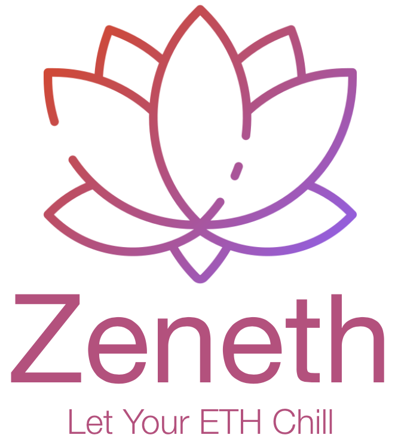

<div align="center">
	
	<br />
	<br />
</div>

<p align="center">
	<b>Gasless Ethereum account abstraction with Flashbots.</b>
</p>

<p align="center">
	🚀 <a href="http://zeneth.app">zeneth.app</a>
	🚧 <a href="https://twitter.com/ScopeLift">@ScopeLift</a>
</p>

<div align="center">
	
	<br />
</div>

## About

With Flashbots, users can send transactions directly to miners so their transactions may be included in a block without ever being seen in the mempool. Miners typically include your transaction in a block because they earn revenue from gas fees, but with flashbots you can include transactions with a gas price of zero, as long as you also include a transaction that pays the miner in ETH in some way.

This is commonly used to protect yourself from bots. For example, by making a large Uniswap trade or executing an arbitrage via Flashbots, bots cannot see your transaction and frontrun it.

**Zeneth uses Flashbots for a different reason—improving UX.**

A major UX problem in Ethereum is that most wallets are not contract wallets, but externally owned accounts (EOAs), such as MetaMask. With EOAs, you always need ETH for gas unless you happen to be interacting with a contract that supports meta-transactions. This can be problematic for user-facing applications as their new users need to acquire both ETH and often some token to user their application.

For example, you don't need ETH for transaction fees on [zkSync's Layer 2 network](https://zksync.io/), but if I'm a new user trying to get DAI into zkSync, I need to first find ETH, use that to pay for gas to enter zkSync, then never use that ETH again. This adds a lot of friction to user onboarding.

Zeneth fixes this. You can now bundle any sequence of transactions, send them for zero gas, and at the end use our "SwapBriber" contract which will swap some of your tokens for ETH to pay the miner. In the demo video you can see the following sequence of transactions:

1. User signs a zero-gas price [transaction](https://etherscan.io/tx/0x5bcf4ce03c6c1ec442f5572d857c37991143a481d7be52c5400231f8587a4e17) approving the zkSync contract to spend their DAI 
2. User signs a zero-gas price [transaction](https://etherscan.io/tx/0x3df79d261af35c6b9bf7a69c3ee1be9a5f7d558cd19595acac761e0bd10cb629) depositing their DAI into zkSync 
3. User signs a zero-gas price [transaction](https://etherscan.io/tx/0x29f2507ca6bd010cbafbc863078d90ce8e79ad2d2288b44927125c50454c8d07) approving the SwapBriber contract to spend their DAI 
4. User signs a zero-gas price [transaction](https://etherscan.io/tx/0x90f16b53efde82ad4cb3eed92c43bb8bf234b6009d1d24a8ec51c4be5052dd7f) transferring tokens to the SwapBriber contract, which swaps those tokens for ETH and transfers the ETH to the miner

Then, all four of these transactions are sent as a bundle to the miner, who includes them in a block.

## Status

Zeneth was built for the [ETHGlobal](https://ethglobal.co/) hackathon. You can learn more by watching the hackathon [submission video](https://www.youtube.com/watch?v=lTivZBhqltY).

The project works on mainnet, but is not currently deployed for public use. Stay tuned to learn more about Zeneth's public launch.


## Development

This project is a monorepo with three packages:

- `contracts` contains the smart contracts
- `zeneth-js` is a TypeScript library containing the core Zeneth logic
- `frontend` is a simple frontend app for interacting with Flashbots

### Dependencies

To ensure that everyone is using the same version of nodejs on this project, [volta](https://volta.sh) is recommended!

### Develop

```sh
yarn
yarn dev
```

### Test

```sh
yarn test
```

### Serve

```sh
yarn build
yarn start
```
